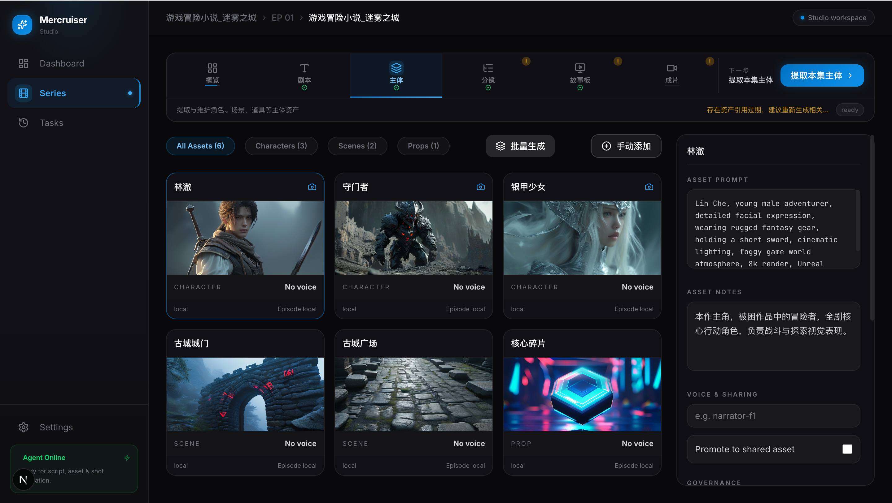
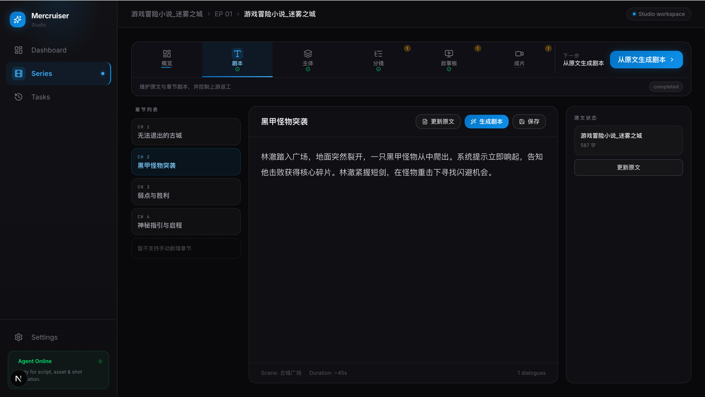
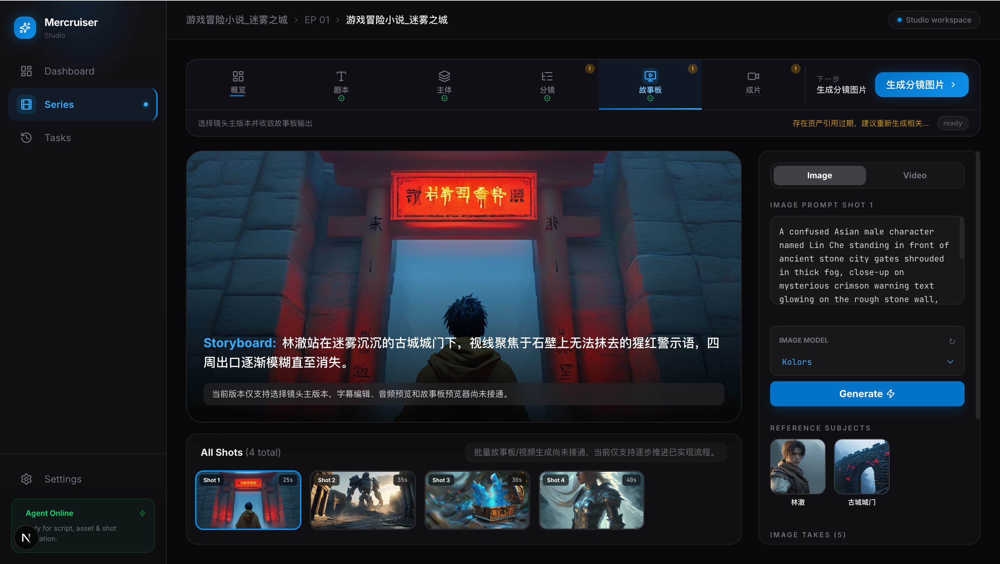

# Mercruiser Studio

Mercruiser Studio 是一个 **AI 驱动的短剧/漫剧生产工作室**，让创作者用 AI 快速从剧本到成片。

- **Local-first 架构**：所有数据存储在本地 JSON，支持离线工作
- **六工位完整工作流**：从剧本→资产→分镜→故事板→成片的端到端生产链
- **AI 内容生成**：自动生成角色形象、分镜脚本、故事板和宣传素材
- **实时协作**：共享资产库、任务跟踪、失败重试

**技术栈**：Next.js 16 App Router · Vercel AI SDK · 本地 JSON 仓储 · 单仓一体化

---

## 核心业务功能

### 1. **系列与剧集管理**
集中式资产库管理，所有剧集共享角色、场景、道具库。支持批量导入、管理和版本控制。

### 2. **六工位专业工作流**

| 工位 | 功能 | 主要操作 |
|------|------|--------|
| **剧本** | 脚本编写与章节组织 | 编辑原文、生成章节、AI 补全 |
| **主体** | 角色/场景/道具资产定义 | 提取主体、定义形象特征、生成 AI 形象 |
| **分镜** | 分镜脚本规划 | 视觉叙述、镜头运动、特效规划 |
| **故事板** | 分镜图片与视觉预览 | 生成故事板、参考素材、质量检查 |
| **生成分镜图片** | AI 驱动的视觉生成 | 选择 AI 模型、调整参数、生成并筛选 |
| **成片** | 时间线装配与导出 | 素材组织、时长管理、一键导出 |

#### 工作流演示

**主体工位** - 角色、场景、道具资产库管理


**剧本工位** - 脚本编写与章节组织


**生成分镜图片工位** - AI 驱动的视觉生成


### 3. **AI 驱动的内容生成**
- 自动从原文提取主要角色与场景
- 利用多个 AI 模型（SiliconFlow、Google Gemini）生成分镜脚本
- 生成角色形象、场景与分镜图片
- 支持 Mock 模式演示（无需 API 密钥）

### 4. **智能任务与工作流治理**
- 自动门禁规则（后续章节需前置章节完成）
- 失败任务重试机制
- 任务中心统一管理
- 进度跟踪与提醒


## 快速开始

### 安装与运行
```bash
# 1. 安装依赖
npm install

# 2. 配置 AI 服务（可选，默认使用 Mock 模式）
cp .env.example .env.local  # 编辑文件，配置 API 密钥

# 3. 启动开发服务器
npm run dev
```

访问 `http://localhost:3000` 即可使用 Studio。

### 配置 AI 服务

**选项 1：SiliconFlow（推荐）**
```env
SILICONFLOW_API_KEY=your_api_key
```

**选项 2：Google Gemini**
```env
GOOGLE_GENERATIVE_AI_API_KEY=your_key
# 或
GEMINI_API_KEY=your_key
```

**Mock 模式**（无需配置）：所有 AI 调用返回演示数据，快速体验功能。

---

## 数据与存储

### 工作区文件
- **默认位置**：`data/studio.json`
- **自定义**：设置 `MERCRUISER_DATA_PATH` 指向其他 JSON 文件
- **原子写入**：所有用户操作和 Agent 工具调用都通过仓储层原子写入，保证数据一致性

### 数据结构
遵循 `lib/domain/` 中定义的 Zod schema：
- 系列、剧集、章节
- 角色、场景、道具、资产
- 分镜脚本与故事板
- 生成任务与失败重试记录

---
## 开发与验证

```bash
# 类型检查
npm run typecheck

# 代码质量检查
npm run lint

# UI 组件验证
npm run test:ui

# 完整验证
npm run test
```

---

## 架构设计

### 目录结构
```
├── app/                          # Next.js 前后端路由
│   ├── api/                      # API route handlers
│   └── (studio)/                 # 工作室核心页面
├── components/                   # UI 组件库
│   ├── episode/                  # 六工位组件
│   ├── shared/                   # 通用组件
│   └── ui/                       # 基础 UI
├── lib/
│   ├── domain/                   # Zod schema 与命令模型
│   ├── server/repository/        # Local-first 数据仓储
│   ├── ai/                       # AI provider、prompts、tools
│   └── client/                   # 客户端工具函数
└── data/
    ├── studio.json               # 工作区数据
    └── fixtures/                 # 测试数据
```

### 核心层级
1. **UI 层**：React 组件与用户交互
2. **命令层**：通过 Domain Command 处理业务逻辑
3. **仓储层**：Local-first JSON 数据读写
4. **AI 层**：Provider 抽象、Prompt 管理、Tool 调用

---

## AI 能力

### 支持的 Provider
- **SiliconFlow OpenAI-compatible endpoint**
- **Google Generative AI (Gemini)**
- **Mock Provider**（演示模式）

### 自动化工具
- 文本生成与分析
- 资产形象提取
- 分镜脚本规划
- 故事板生成
- 提示词优化

---

## 故障排查

| 问题 | 解决方案 |
|------|--------|
| AI 调用失败 | 检查 API 密钥配置，查看 `Agent Online` 面板状态 |
| 数据不一致 | 删除 `data/studio.json`，重新启动应用 |
| 工位被锁定 | 检查前置工位是否完成，查看门禁规则 |
| 性能缓慢 | 清理本地 `.next` 缓存，重启开发服务器 |

---

## 贡献指南

参考 [CONTRIBUTING.md](./CONTRIBUTING.md)。

---

## 许可证

MIT License - 详见 [LICENSE](./LICENSE)
